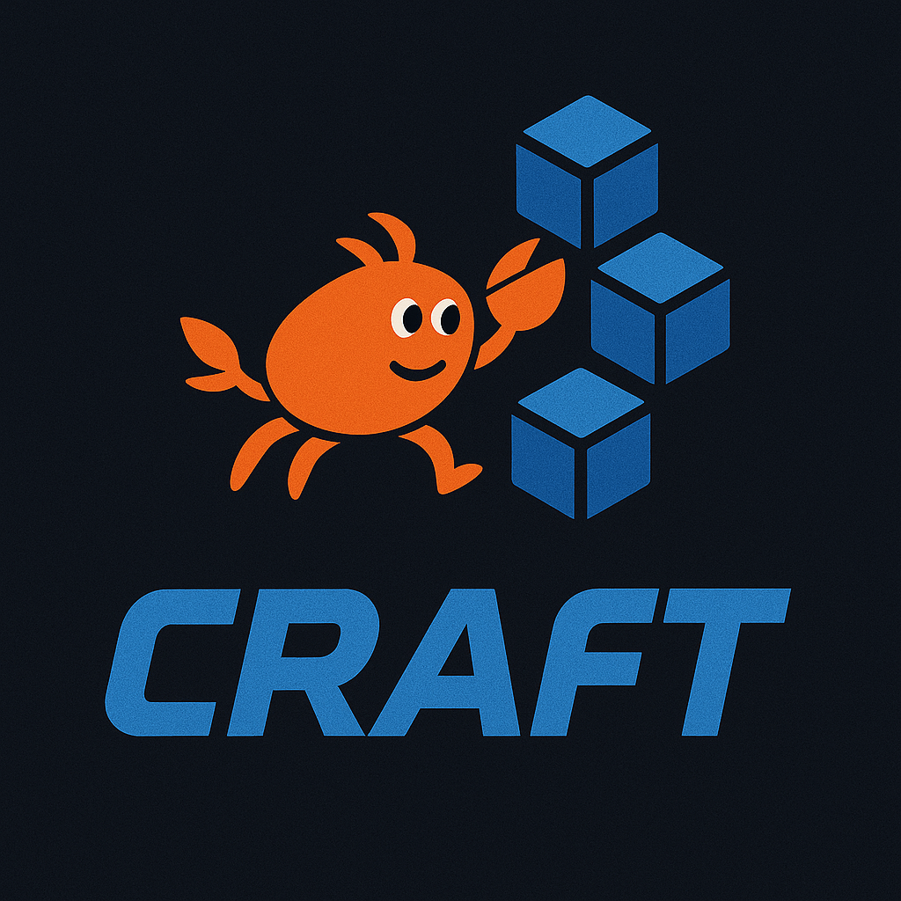

<p align="center">
  
</p>

# 📦 Craft Package Manager


**Craft** is a blazing fast, Rust-based package manager designed for modern web development. It focuses on speed, reliability, and a delightful developer experience.

## ✨ Features

- 🚀 **Blazing Fast**: Written in Rust for maximum performance.
- ⚡ **Parallel Downloads**: Resolves and downloads packages concurrently.
- 🔒 **Reliable Locking**: Deterministic installs with `package-lock.json` support (coming soon).
- 📦 **Efficient Caching**: Global cache to save disk space and bandwidth.
- 🛠️ **Developer Friendly**: Intuitive CLI with helpful error messages.
- 🏗️ **Multi-Platform**: Native binaries for Linux, macOS (Intel & Apple Silicon), and Windows.

## 🚀 Installation

### From Binary (Recommended)

Download the latest release for your platform from the [Releases](https://github.com/craftpkg/craft/releases) page.

### From Source

Ensure you have [Rust](https://www.rust-lang.org/tools/install) installed.

```bash
git clone https://github.com/craftpkg/craft.git
cd craft
cargo install --path apps/craft
```

## 📖 Usage

### Initialize a Project

Currently, Craft works with existing `package.json` files. Support for `craft init` is coming soon!

### Install Dependencies

Install all dependencies listed in your `package.json`:

```bash
craft install
```

### Add Packages

Add a package to your dependencies:

```bash
craft add react
```

Add multiple packages:

```bash
craft add react react-dom
```

Add a development dependency:

```bash
craft add typescript -D
```

### Remove Packages

Remove a package from your dependencies:

```bash
craft remove react
```

### Run Scripts

Run a script defined in your `package.json`:

```bash
craft run build
```

Shortcuts for common scripts:

```bash
craft start   # Equivalent to: craft run start
craft test    # Equivalent to: craft run test
```

## 🤝 Contributing

Contributions are welcome! Please feel free to submit a Pull Request.

1. Fork the repository
2. Create your feature branch (`git checkout -b feature/amazing-feature`)
3. Commit your changes (`git commit -m 'Add some amazing feature'`)
4. Push to the branch (`git push origin feature/amazing-feature`)
5. Open a Pull Request

## 📄 License

This project is licensed under the MIT License - see the [LICENSE](LICENSE) file for details.
